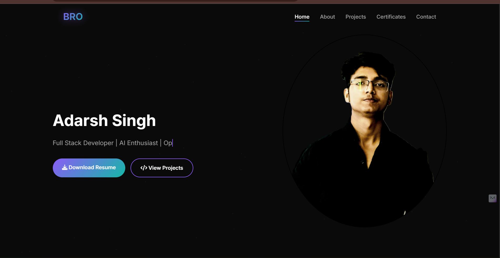
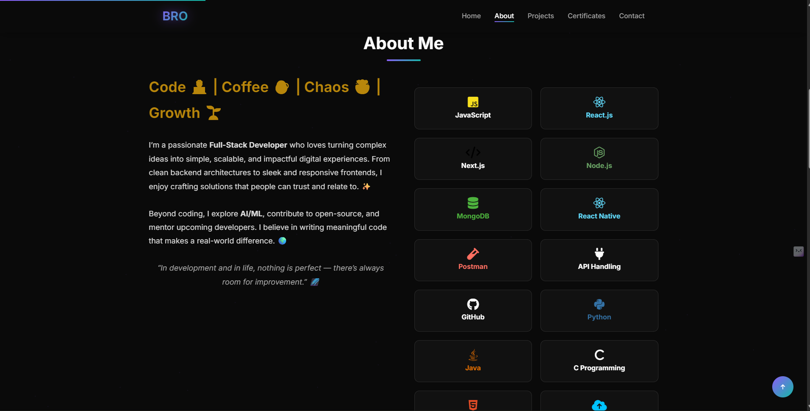
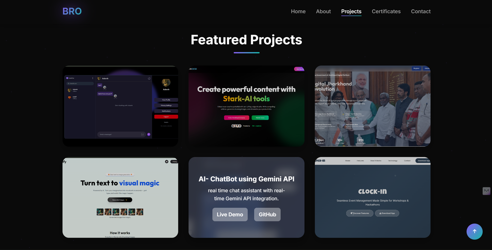
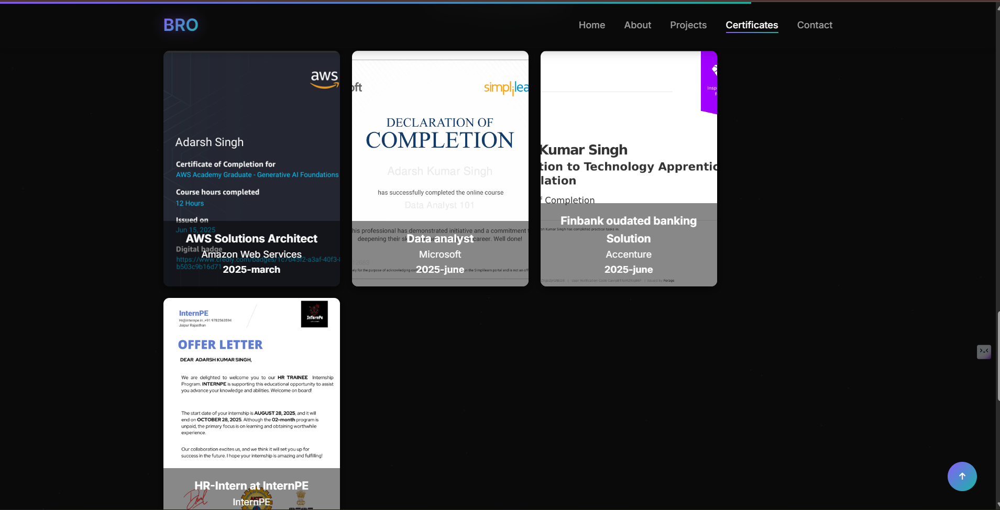
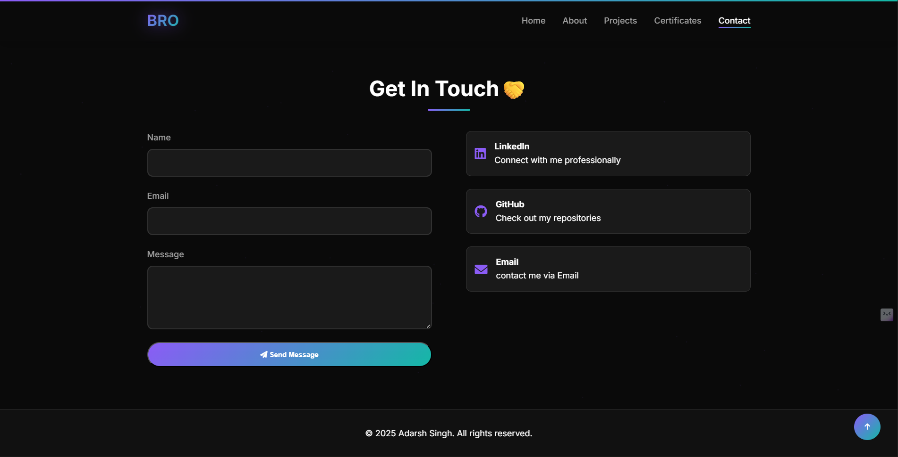

Adarsh Singh — Portfolio

Live Demo: https://adarsh-portfolio-pearl.vercel.app

  
  
  
  
  

Started with silence.  
Now the graph sings.  
Not for stars. Not for likes.  
But for the quiet joy of building something that feels.

A responsive personal portfolio to showcase my projects, experience & achievements.
🛠 Built With
HTML • CSS
JavaScript

Deployed on Vercel

🚀 Features
Responsive design (desktop + mobile)
Project gallery with screenshots
Skill / experience section
Contact / social links

📥 Getting Started
# Clone the repo
git clone https://github.com/adarsh005599/Adarsh-portfolio.git

cd Adarsh-portfolio

npm install
npm run dev       # run locally

📂 Repository Structure

/

├── index.html

├── style.css

├── script.js

├── (images, icons, etc.)

└── README.md

📫 Contact
Email: happysingh005599@gmail.com.com

LinkedIn:[https://www.linkedin.com/in/adarsh-singh0099] 

GitHub: [https://github.com/adarsh005599]
